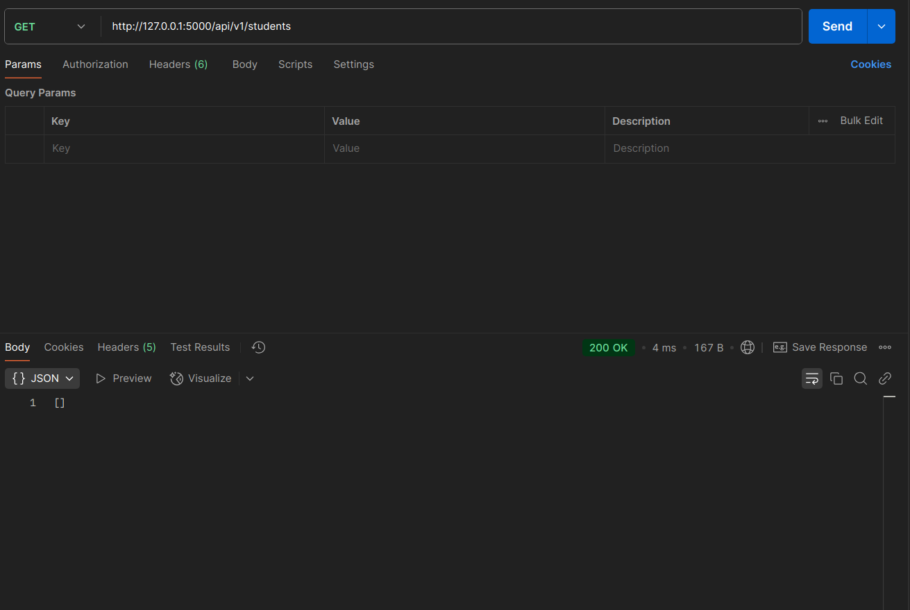
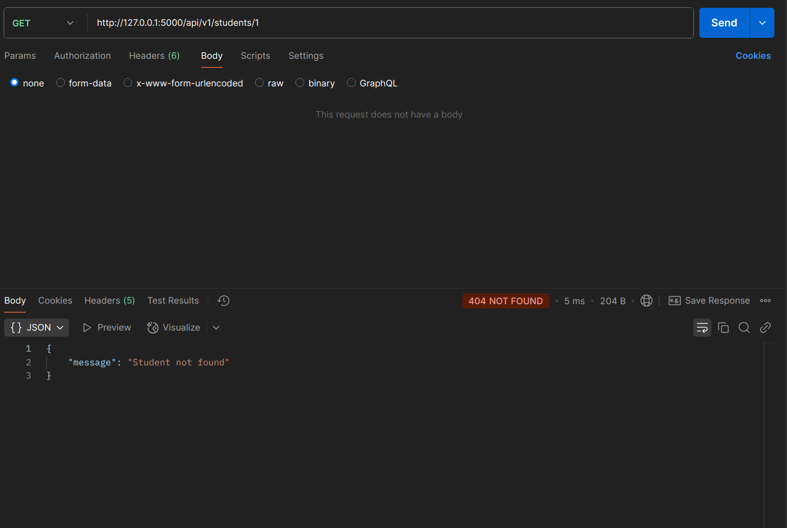
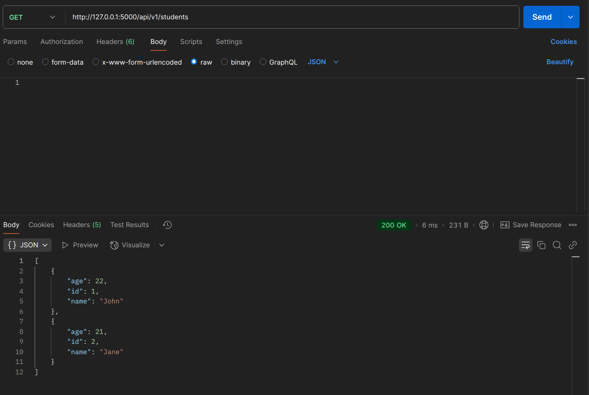
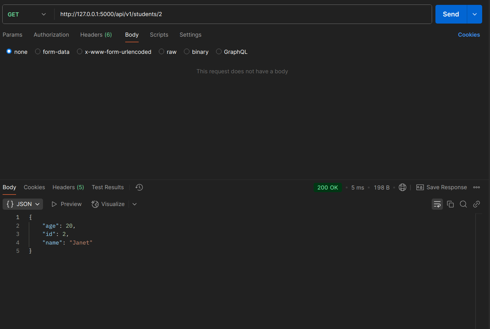
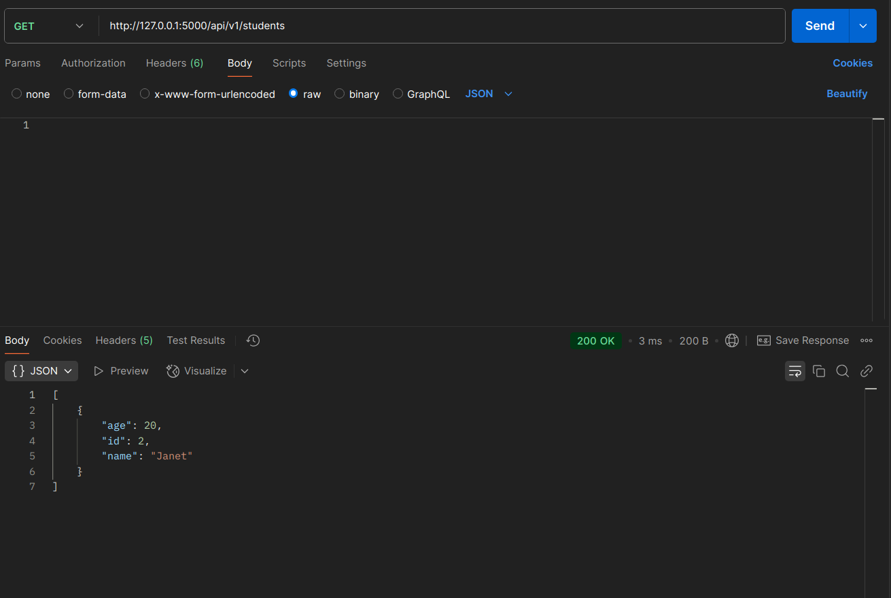
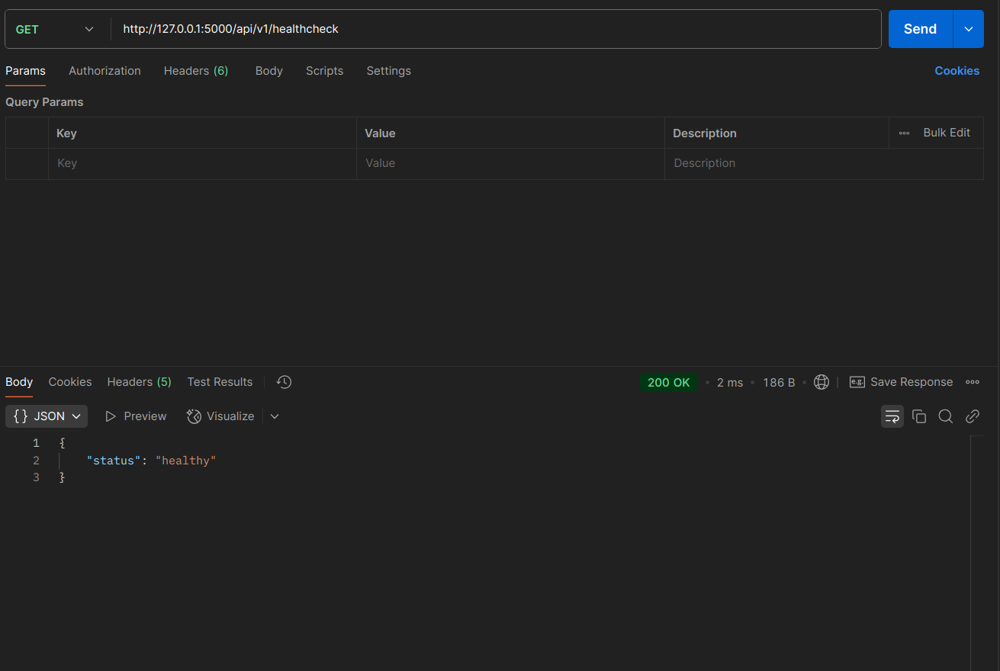

# Student CRUD API

## Project Description

This project is a simple CRUD API designed for managing student records. The API is built using Python and Flask, following best practices for RESTful API design and the Twelve-Factor App methodology. It provides functionality to create, read, update, and delete student records while ensuring proper API versioning, structured logging, and configuration management using environment variables.

The API is container-ready, follows dependency management practices, and supports database migrations to maintain schema consistency.

## Prerequisites

Before proceeding, ensure you have the following installed on your system:

- Python 3.8+
- pip (Python package manager)
- Virtualenv (Recommended for managing dependencies)
- Make (for executing build and run commands)
- PostgreSQL or SQLite (for database)

## Requirements File (`requirements.txt`)

The project dependencies are managed through `requirements.txt`. Below is the content of this file:

```
Flask==3.1.0
Flask-Migrate==4.1.0
Flask-SQLAlchemy==3.1.1
python-dotenv==1.0.1
```

## Setup Instructions

1. Clone the repository and switch to `milestone_1` branch:
    ```bash
    git clone --branch milestone_1 https://github.com/pasivinay/one2n-sre-bootcamp.git
    cd one2n-sre-bootcamp/milestone_1
    ```

2. Create and activate a virtual environment:
    ```bash
    python3 -m venv venv
    source venv/bin/activate  # On Windows use `venv\Scripts\activate`
    ```

3. Install dependencies:
    ```bash
    make install
    ```

4. Set up the database:
    ```bash
    make create-db
    ```

5. Apply database migrations:
    ```bash
    make migrate
    ```

6. Run the application:
    ```bash
    make run
    ```

7. The API will be available at `http://127.0.0.1:5000/`.

## API Endpoints

### 1. Get all students
- **Endpoint:** `GET /api/v1/students`
- **Description:** Fetches all student records from the database.

### 2. Get a student by ID
- **Endpoint:** `GET /api/v1/students/<id>`
- **Description:** Retrieves details of a specific student by their unique ID.

### 3. Add a new student
- **Endpoint:** `POST /api/v1/students`
- **Description:** Adds a new student to the database.
- **Request Body (JSON Example):**
    ```json
    {
        "name": "John Doe",
        "age": 21
    }
    ```

### 4. Update student details
- **Endpoint:** `PUT /api/v1/students/<id>`
- **Description:** Updates the details of an existing student.
- **Request Body (JSON Example):**
    ```json
    {
        "name": "John Updated",
        "age": 22
    }
    ```

### 5. Delete a student
- **Endpoint:** `DELETE /api/v1/students/<id>`
- **Description:** Deletes a student record from the database.

### 6. Health check
- **Endpoint:** `GET /api/v1/healthcheck`
- **Description:** Checks if the API is running properly.


## Postman Demo

Below are snapshots demonstrating the working of the CRUD API. These images can be found in `./postman_collection/postman_snapshots`.

1. **Get all students** - Initially, the list is empty.
   

2. **Get a specific student by ID** - Response shows "student not found".
   

3. **Add a new student** using `POST` request.
   

4. **Get all students** - Now it shows the added student.
   

5. **Get a specific student by ID** - Returns the student details.
   

6. **Add another student**.
   

7. **Get all students** - Shows multiple students.
   

8. **Update student details** using `PUT` request.
   

9. **Get updated student details**.
   

10. **Delete a student** using `DELETE` request.
    

11. **Get all students** - Confirms student deletion.
    

12. **Run health check request**.
    


## Using Postman for API Testing

1. Open Postman and import the collection file:
   - Navigate to `milestone_1/postman_collection/one2n-sre-bootcamp.postman_collection.json`
   - Click **Import** in Postman and select this file.

2. Execute API requests:
   - Use the available endpoints to perform CRUD operations.
   - Check the responses to validate the API functionality.

