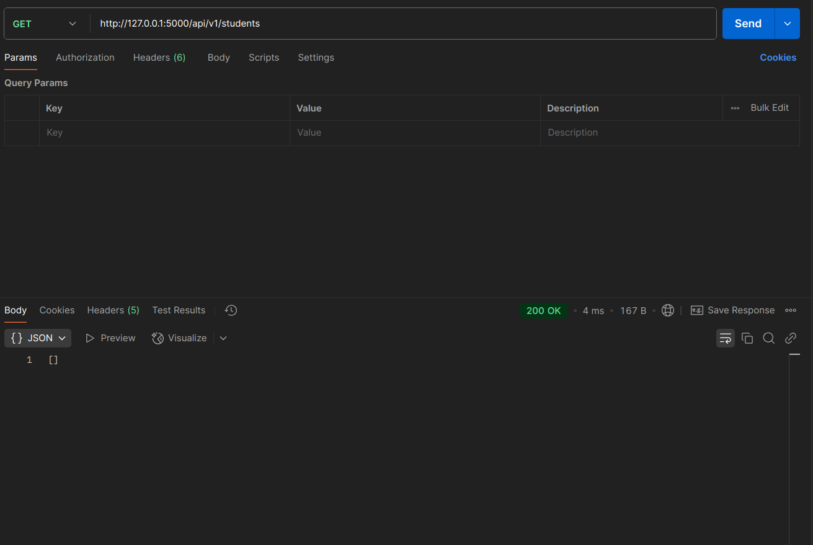
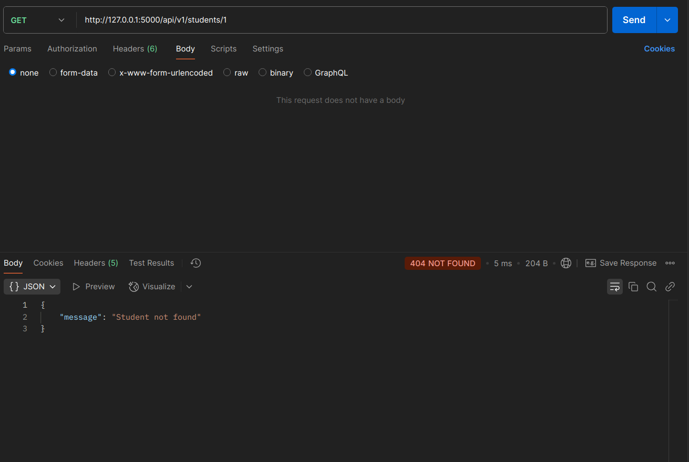
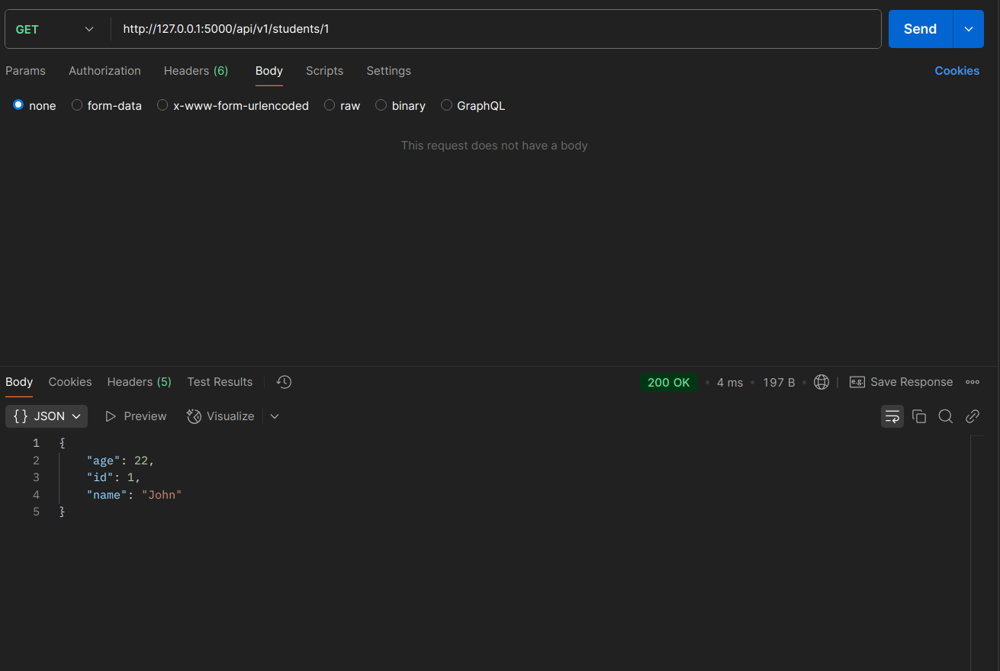
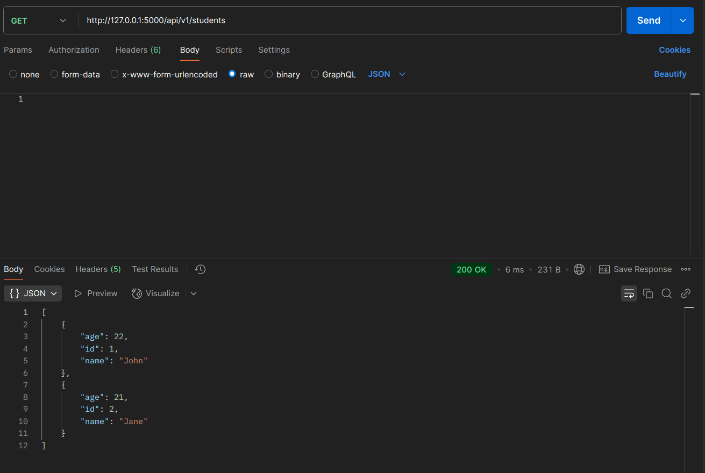
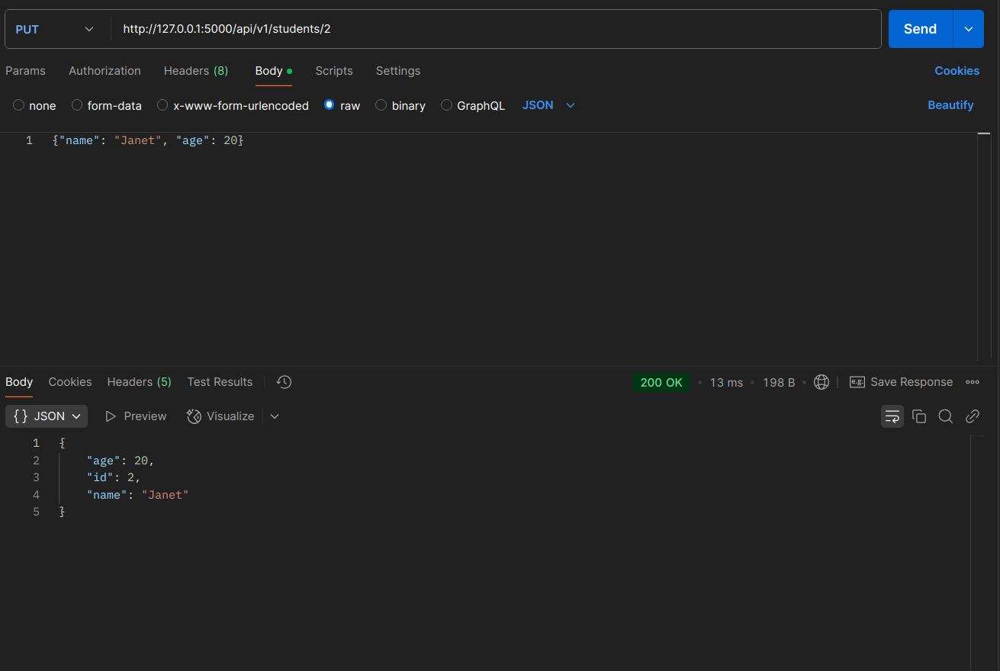
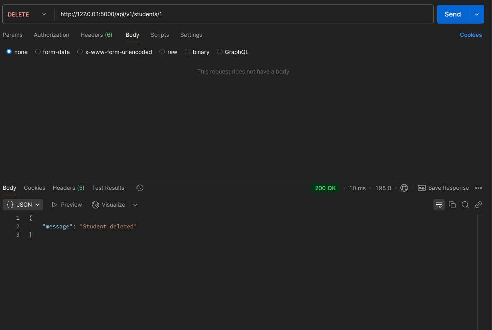
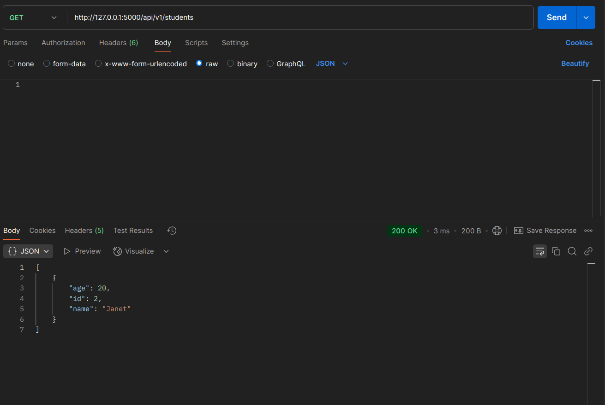
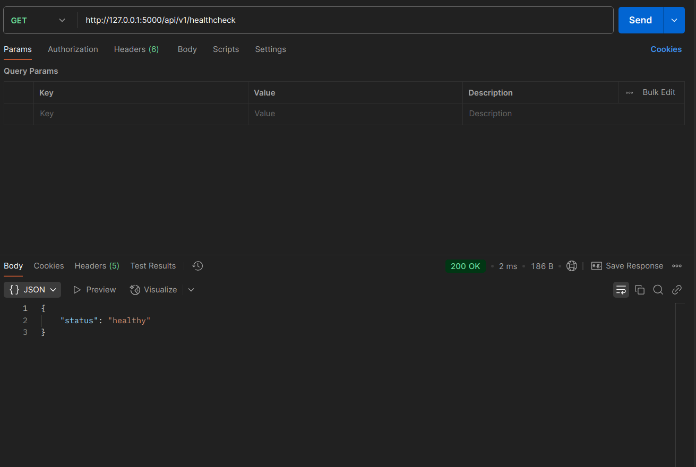

# Milestone 1 - Student CRUD API

This is a simple CRUD API for managing student records.

## Setup Instructions

1. Clone the repository:
    ```bash
    git clone https://github.com/pasivinay/one2n-sre-bootcamp.git
    cd student-crud-api
    ```

2. Install dependencies:
    ```bash
    make install
    ```

3. Set up the database:
    ```bash
    make create-db
    ```

4. Run the app:
    ```bash
    make run
    ```

5. API will be available at `http://127.0.0.1:5000/`.

## API Endpoints

- `GET /api/v1/students` - Get all students
- `GET /api/v1/students/<id>` - Get a student by ID
- `POST /api/v1/students` - Add a new student
- `PUT /api/v1/students/<id>` - Update a student's information
- `DELETE /api/v1/students/<id>` - Delete a student
- `GET /api/v1/healthcheck` - Health check

## Postman Collection

You can import the Postman collection from `postman_collection/one2n-sre-bootcamp.postman_collection.json` to test the API.

# Postman Demo

Below are snapshots demonstrating the working of the CRUD API. These images can be found in `./postman_collection/postman_snapshots`.

1. **Get all students** - Initially, the list is empty.
   

2. **Get a specific student by ID** - Response shows "student not found".
   

3. **Add a new student** using `POST` request.
   

4. **Get all students** - Now it shows the added student.
   

5. **Get a specific student by ID** - Returns the student details.
   

6. **Add another student**.
   

7. **Get all students** - Shows multiple students.
   

8. **Update student details** using `PUT` request.
   

9. **Get updated student details**.
   

10. **Delete a student** using `DELETE` request.
    

11. **Get all students** - Confirms student deletion.
    

12. **Run health check request**.
    